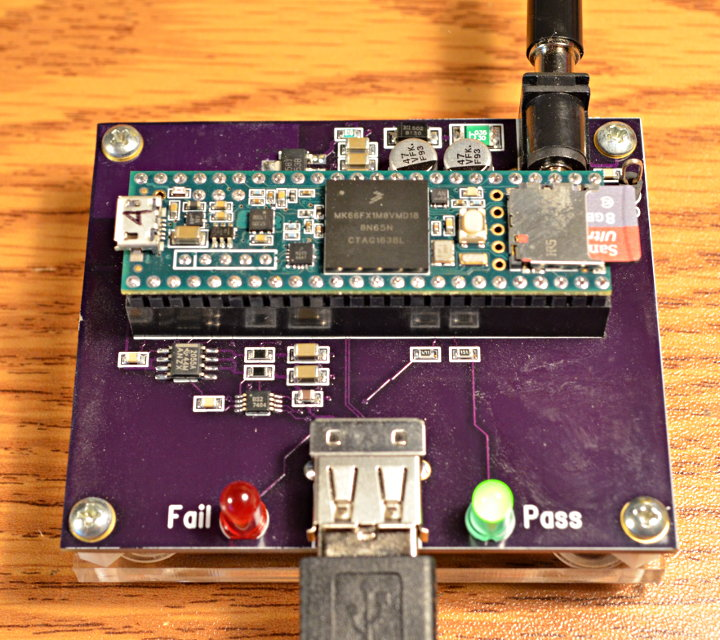

# USB Tester

This is the test board PJRC uses for testing the USB port on new Teensy boards.

At this point this whole thing is pretty much undocumented.  Someday I intend to
write a blog article about the lengthy process and analog challenges that came
up in the design (sensing the USB current).
